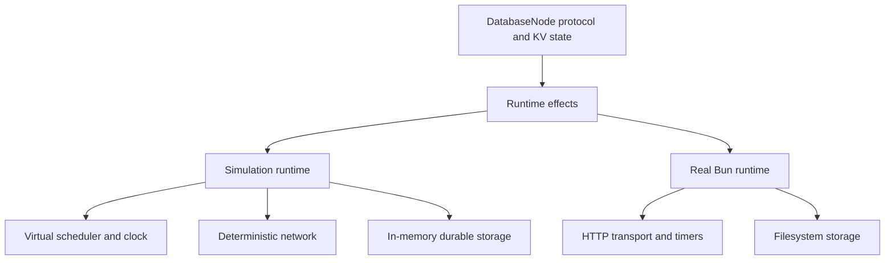

# FaultSeed

FaultSeed runs a small replicated key-value database inside a deterministic simulation. It is an educational implementation inspired by deterministic simulation testing techniques used in distributed systems. It is not equivalent to FoundationDB and is not a production consensus system.

The central guarantee is that a seed and configuration define the workload, fault choices, event order, and trace. Running the same version with the same inputs produces the same trace hash and, when one exists, the same invariant violation.

## Why simulate a distributed system?

Real integration tests depend on OS scheduling, real time, sockets, and storage behavior. A rare message delay followed by a crash can be hard to reproduce, and a test that fails once may not fail again. FaultSeed moves those decisions into one process. It can advance virtual time directly to the next event and repeat the exact same message and storage decisions from a seed.

The database uses a small Raft-inspired protocol: one elected leader, terms and votes, an ordered log, durable replication to a majority, and a quorum confirmation for reads. A write returns success only after the leader and a follower have stored the entry and the leader has committed it. This is a deliberately small model, not a complete Raft implementation.

## Architecture

`DatabaseNode` contains the protocol and KV state machine. It produces effects for storage, messages, timers, client responses, and trace events. The simulation runtime handles those effects with the virtual scheduler, deterministic network, and in-memory durable storage. The real runtime handles them with Bun timers, HTTP, and local files.



The simulator uses one event queue ordered by virtual time and a monotonic sequence number. It does not sleep. Randomness uses a seeded generator with separate streams for workload, faults, network, and storage, so adding a draw in one area does not reshuffle every other decision.

The network schedules in-memory packets with seeded latency. It can drop, duplicate, delay, reorder, and block traffic across partitions. Healing allows new messages across all links again. The storage model gives every node a durable state map and supports delayed, failed, dropped, or corrupted writes. Crashing removes the node's volatile object; restarting creates a new object that restores its state from that node's durable map.

## Invariants and replay

The invariant monitor checks that acknowledged writes remain in the committed leader log, committed entries do not conflict, commit indexes do not move backwards, leader reads match committed state, and replicas converge after the network heals. Malformed durable state raises `STORAGE_CORRUPTION`. An invariant failure includes the seed, virtual time, event number, and relevant key or node.

When `sim` or `fuzz` finds a failure, FaultSeed saves its configuration under `.faultseed/failures/<seed>.json`. Replay regenerates the workload and decisions from that configuration. `trace` prints the canonical ordered event trace; the same trace is hashed with SHA-256.

Replay can shrink a failing operation prefix while preserving the invariant:

```bash
bun run replay --seed 3 --shrink
```

The shrinker uses deterministic delta reduction over the generated workload prefix. It reports the reduced operation count and stores the reduced configuration for later replay.

## The acknowledged-write bug

An earlier protocol revision allowed the leader to acknowledge a write after only its local durable write. The saved historical scenario at seed `1` used 80 operations, a fault rate of `0.35`, and a 2,000 ms virtual-time limit. Its trace ended in `ACKNOWLEDGED_WRITE_LOST`: after the leader failed, the remaining nodes could elect a leader without the acknowledged entry.

The protocol fix removed local acknowledgements. The leader now responds only after durable replication to a majority and commit. The historical fixture retains the original failure classification and configuration. Replaying it runs the current code, so the old violation no longer occurs:

```text
$ bun run replay --seed 1 --quiet
historical failure: ACKNOWLEDGED_WRITE_LOST
PASS seed=1 traceHash=...
```

The fixture's old trace hash records the pre-fix trace. Trace hashes are expected to change when simulator behavior changes; determinism is guaranteed for the same simulator version and configuration.

## Run FaultSeed

Install the development dependencies and typecheck:

```bash
bun install
bun run typecheck
```

Run a deterministic simulation, fuzz consecutive seeds, replay a seed, or print its trace:

```bash
bun run sim --seed 48291 --ops 1000
bun run fuzz --runs 10000 --seed-start 1 --ops 100
bun run replay --seed 48291
bun run trace --seed 48291 --ops 2
```

Useful options include `--fault-rate <0..1>` and `--max-virtual-time <ms>`. `sim` and `trace` accept `--quiet` for a one-line pass result and `--trace` to print the full event log. Fuzz output reports the measured runtime, number of operations, total virtual time, and failing seeds. The default fault rate is `0.05`.

A short trace excerpt from seed `48291` shows storage restoration, a deterministic election, and packet delivery:

```text
000007 t=1 node-b STORAGE_READ found=false id=node-b:1:storage:0 key=state
000008 t=1 node-b RESTORE index=0 term=0
000013 t=27 node-a STORAGE_WRITE_SCHEDULE delay=2 id=node-a:1:storage:1 key=state
000017 t=29 node-a ELECTION_START term=1
000018 t=30 node-a -> node-b PACKET_DELIVER copy=0 id=1
000029 t=33 node-a BECOME_LEADER term=1
```

The full trace is intentionally detailed for debugging. Use `--ops` to keep trace output manageable.

## Real runtime

The optional HTTP adapter runs one Bun process per node. In three terminals:

```bash
bun run node --id node-a
bun run node --id node-b
bun run node --id node-c
```

Each node listens on `127.0.0.1:8081`, `:8082`, or `:8083`. Send a client request to the node that should accept it:

```bash
curl -X POST http://127.0.0.1:8081/kv/put \
  -H 'content-type: application/json' \
  -d '{"key":"user","value":"bhupesh"}'

curl -X POST http://127.0.0.1:8081/kv/get \
  -H 'content-type: application/json' \
  -d '{"key":"user"}'
```

Node state is stored in `.faultseed/real` by default. Override it with `--data <directory>`. The simulator remains the primary runtime; the HTTP adapter exists to show that the same database node logic can run with operating-system effects.
